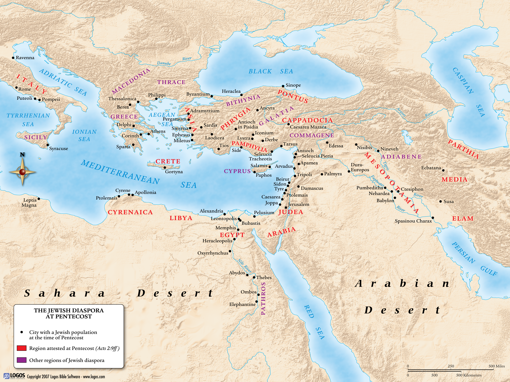

# Einführung ins Christentum
{: .r-fit-text}

### Wie wird die christliche Botschaft idealerweise vermittelt?

Sommersemester 2025
Prof. Dr. Nathan Gibson

## Veranstaltungen

"Spiritual Flourishing" im Zeitalter der Maschinen

- am Freitag, 09.05. um 15:00 im Hörsaalzentrum 14

## 📈 Rückblick: Lernziel

1. Eigene Ziele im Kurs setzen.
2. Westliche Vorstellungen des Christentums erstmal hinterfragen.

## Projekte

Bitte sich unter "Terminvergabe Projekt" in OLAT einschreiben.

## Einleitung

- Übungswürfel

## Heutiges Lernziel

Die Rolle der schriftlichen und mündlichen "apostolischen" Traditionen im frühchristlichen Selbstverständnis skizzieren können. 

## Lektüre: Apostelgeschichte 1-2

Zusammenfassung: <https://etherpad.studiumdigitale.uni-frankfurt.de/p/25christentum2>

## Lektüre: Apostelgeschichte 1-2

## Lektüre: Doctrina Addai

Zusammenfassung: <https://etherpad.studiumdigitale.uni-frankfurt.de/p/25christentum2>

## Aufgabe

Zwischen den 2 Texten einen kurzen Vergleich für sich stichpunktartig aufschreiben: Was machen die Apostel? Warum ist diese Aktivität für die christliche Botschaft wichtig?

| **Aspekt**       | **Apostelgeschichte**                     | **Doctrina Addai**                     |
|-------------------|--------------------------------|---------------------------------|
| Rolle der Aposteln |                                |                                 |
| Bedeutung         |                                |                                 |

## Diskussion

## Vorschau

Was wird mit wem gefeiert?

Aufgabe: Das Datum des nächsten Ostern nach den Quartodecimans bzw. nach Aphrahats Vorgaben rechnen.