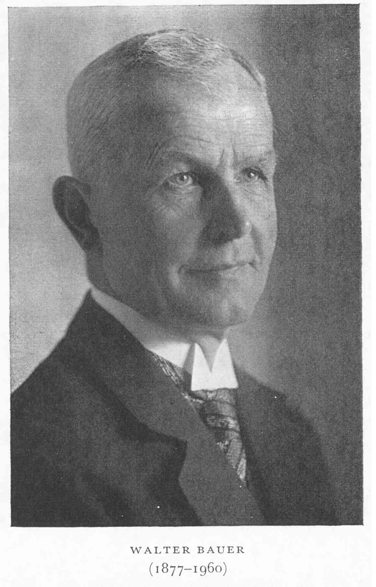

# Einführung ins Christentum
{: .r-fit-text}

### Warum ist es wichtig, richtig zu glauben?

Sommersemester 2025
Prof. Dr. Nathan Gibson

## 📈 Rückblick: Lernziel

Hybridität und Selbstpositionierung zwischen jüdischen Gemeinden und Jesu Nachfolger anhand von Ritualen illustrieren können.

## 📈 Rückblick: Pesach und Ostern

- Ein Streit über das Datum (wiederspiegelt Autoritätsstrukturen in Gemeinden)
- Quellen:
  - fruhër: christliche Texte von Aphrahat, Melito, Origenus
  - später: jüdisch-rabbinische Texte

## 📈 Rückblick: Pesach und Ostern

- Ähnlichkeiten in der Erzählung bzw. im Ritual
  - = Christliche Aneignung einen jüdischen Festes oder in manchen Elementen auch umgekehrt? (so Yuval)
  - Auf jeden Fall müssen wir von Gesprächen zwischen und unter Gemeinden ausgehen, die über Jahrhunderte stattgefunden haben und Weiterfolgen sowohl für christliche als auch für jüdische Gemeinden hatte.

## 📈 Rückblick: Frühjüdische und Frühchristliche Diskussionen bis ins 4. Jhdt.

Finden nicht nur zwischen getrennten jüdischen und christlichen Gemeinden sondern auch innerhalb dieser Gemeinden.

## Werkzeuge

S. <https://www.zotero.org/groups/5969859/christentum/tags/_reference/library>

## Projekte

## Einleitung



## Heutiges Lernziel

Sowohl die innere Logik der orthodoxischen Erzählung als auch historisch-kritische Bemerkungen daran erklären können.

## "Orthodox"

- _ortho_ "richtig, gerade" + _doxa_ Ehre = rechtgläubig
- bezieht sich auf das Phänomen "Normativität"
- auch: Selbstbezeichnung für bestimmte Kirchen
- auch: von strenger Lehrmeinung (z.B. orthodoxisches Judentum)

## Häresie/Ketzerei

- nicht orthodox
- "heteredox" - anders als orthodox

## Konzile

- 325 Nicea 
  - Jesus Christus als *homoousios*, "von der selben Natur (als der Vater)", oder _homoiousious_, "von einer ähnlichen Natur (als der Vater)" 
  - Haupthäretiker: Arius

## Konzile

- 432 Ephesus
  - Jesus Christus als eine Person(lichkeit) (göttlich und menschlich) oder zwei
  - Maria als _theotokos_ "Gottesgebärerin" oder _christotokos_ "Christusgebärerin"
  - Haupthäretiker: Nestorius

## Konzile

- 451 Chalcedon
  - Jesus Christus mit 2 Naturen oder 1 (_diophysis_ oder _miaphysis_)

## Walter Bauer 1877-1960

{: style="height:500px"}

- 1934: _Rechtgläubigkeit und Ketzerei im ältesten Christentum_

## Die Bauer-These

- Orthodoxie als zurückblickend
- Vielfalt anstatt Orthodoxie als dominant im Christentum (schon im 1. Jahrhundert?)
- Die Kirche in Rom als die, die Orthodoxie durchsetzt

## Diskussion

- Stärken und Schwächen?

## W. Bauer mit einem kritischen Blick

- Paradigmenwechsel: historische Bewegungen nicht durch eine normative Linse blicken, sondern durch historische Dokumente.
- Dennoch: Hat die frühe Vielfalt evtl. übertrieben und manche proto-orthodoxische Quellen ignoriert. 
- Hat dazu beigetragen, dass nicht-westliche christliche Bewegungen als heterodox angesehen werden. (Hier auch seine Ideologie in der NS-Zeit beachten.)

## Vorschau

Wer und was ist heilig?