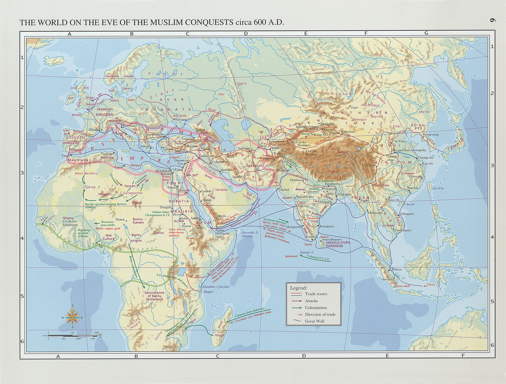

# Einführung ins Christentum
{: .r-fit-text}

### Wie verstanden sich Christen und Muslime?

Sommersemester 2025
Prof. Dr. Nathan Gibson

## Ansagen

- Islamische Geschichte Online (12.07., 19.07. und 26.07.)
- Sprechstunden
- Nächste Woche: Feiertag

## 📈 Rückblick: Lernziel

Den Heiligkeitsbegriff mit Beispielen erklären können.

## 📈 Rückblick: 

- Märtyrer - Menschen, die ihr Glaube bekannt haben, wenn dies das Leben gekostet hat. (In christlichen Traditionen: keine Kämpfer)
- heilig - abgesondert
- Heilige - Menschen, die für ihren ausgezeichneten Charakter (insbesondere Christus-ähnliches Verhalten, asketische Triumphe bzw. Wunder) von einer Kirche verehrt sind (z.B. in der Liturgie)

## 📈 Rückblick: 

- Askese - Selbstverweigerung. (In christlichen Traditionen: insbesonder nach Modell Jesu Christi)
- Hagiographie - Literatur über die Heiligen

## 📈 Rückblick: Historische Entwicklung

Unterschiedliche Modelle

- In Syrien/Nordmesopotamien: _benei/benath qiyama_ ("Söhne/Töchter des Bundes"?), _Iḥidāyā_ ("einzig"). Manche "Anachoret"
- Mani (216 – ca. 276) und die Manichäer
- St. Antonius der Große (ca. 251-356) (Koinobitentum) -> Regula Benedicti -> andere Varietäten des Mönchtums

## 📈 Rückblick: Auswirkungen

- Änderungen in den wirtschaftlichen und sozialen Strukturen
- Populäre Bewegungen, die über die Grenzen der kirchlichen Autoritäten hinausgehen
- Positive und negative Betrachtungen im Islam

## Projekte

## Einleitung

- Darstellung christlich-muslimische Beziehungen

## Heutiges Lernziel

Einige Bereiche nennen können, in denen der langjährige Austausch zwischen islamischen und ostkirchlichen Gemeinschaften besonders bedeutsam war.

## Hintergrund

{: style="height: 900px"}

<figcaption>"The World on the Eve of the Muslim Conquests circa 600 A.D." in "Early Muslim Conquests" in Hugh Kennedy, Historical Atlas of Islam (2012). https://doi.org/10.1163/1573-3912_hai_HAI_6</figcaption>

## Hintergrund

{: style="height: 900px"}

<figcaption>"Early Muslim Conquests" in Hugh Kennedy, Historical Atlas of Islam (2012). https://doi.org/10.1163/1573-3912_hai_HAI_7</figcaption>

## Quellen

- Koran
- Hadith
- Arabische Inschriften
- Geschichtsschreibung
- Dogmatische Schriften
- Rechtliche Quellen
- Hagiographie

## Schriftliche Kontaktbereiche von Christen und Muslimen

- Koran
- Bibelübersetzungen
- Übersetzungen, Kommentare und Lehre der klassischen Philosophie
- Apologetik (Rechtfertigung mit Bezug auf den Koran, die Bibel und die Philosophie)
- Politisch-soziale Verhandlungen

## Entwicklungen

- Sprache und Literatur (inkl. Theologie und Liturgie auf Arabisch)
- (meistens langsame) Verminderung der Gemeinden u.a. durch den sozialen Druck (Umkehrosmose)
  - als Antwort darauf: rechtliche Anpassungen aus mehreren Seiten
  - Strukturen und Ideologien zum Selbstschutz
- weiterhin Wissensaustausch und Expertenkreise interreligiös

## Vorschau

Wie entwickelte sich die Kirche außerhalb des Römischen Reiches? (I)