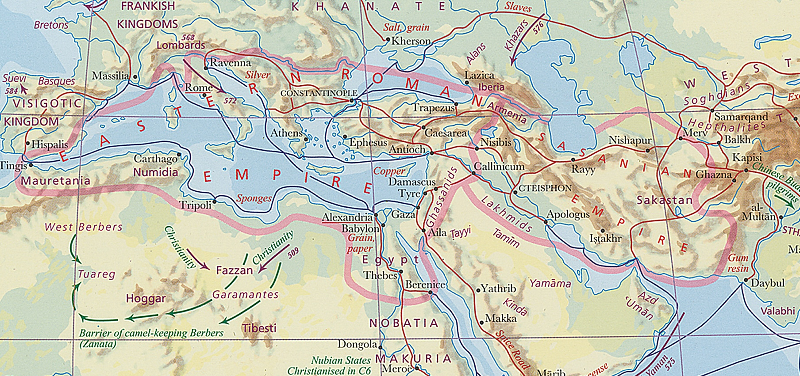
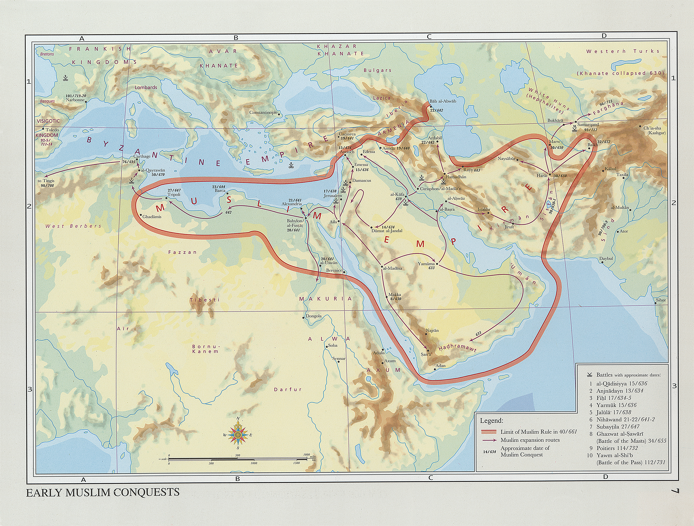

# Einführung ins Christentum
{: .r-fit-text}

### Wie entwickelte sich die Kirche außerhalb des Römischen Reiches? (I)

Sommersemester 2025
Prof. Dr. Nathan Gibson

## 📈 Rückblick: Lernziel

Einige Bereiche nennen können, in denen der langjährige Austausch zwischen islamischen und ostkirchlichen Gemeinschaften besonders bedeutsam war.

## 📈 Rückblick: Christen und Muslime

{: style="height: 900px"}

<figcaption>"The World on the Eve of the Muslim Conquests circa 600 A.D." in "Early Muslim Conquests" in Hugh Kennedy, Historical Atlas of Islam (2012). https://doi.org/10.1163/1573-3912_hai_HAI_6</figcaption>

## 📈 Rückblick: Christen und Muslime

{: style="height: 900px"}

<figcaption>"Early Muslim Conquests" in Hugh Kennedy, Historical Atlas of Islam (2012). https://doi.org/10.1163/1573-3912_hai_HAI_7</figcaption>

## 📈 Rückblick: Christen und Muslime

Diskussion in Kleingruppen (<https://etherpad.studiumdigitale.uni-frankfurt.de/p/25christentum7>):

- Welche _Quellen_ gibt es für die frühen christlich-muslimische Beziehungen?
- Wie überschneiden sich der Koran und arabische Bibelübersetzungen?
- Wie haben Christen an gemeinsame _intellektuelle Projekte_ unter islamischer Herrschaft teilgenommen?
- Welche Themen (z.B.) mussten Christen mit muslimischen Herrschern verhandeln?

## 📈 Rückblick: Christen und Muslime - Weitere Entwicklungen

- Sprache und Literatur (inkl. Theologie und Liturgie auf Arabisch)
- (meistens langsame) Verminderung der Gemeinden u.a. durch den sozialen Druck (Umkehrosmose)
  - als Antwort darauf: rechtliche Anpassungen aus mehreren Seiten
  - Strukturen und Ideologien zum Selbstschutz
- weiterhin Wissensaustausch und Expertenkreise interreligiös

## Projekte

- Begegnungen mit dem Islam

## Einleitung

- Wie würde sich deine Perspektive auf das Christentum verändern, wenn du wüsstest, dass in den ersten acht Jahrhunderten die Hälfte aller Christen außerhalb Europas lebte?

## Heutiges Lernziel

Die größten Gemeinsamkeiten und Unterschiede zwischen der Kirche des Ostens und den griechischen oder römischen Kirchen identifizieren.

## Kirche des Ostens

- Timotheos I (Patriarch/Katholikos, 780-823)
  - Hauptsitz in Baghdad, Bischöfe bis Indien und China
  - Austausch mit dem Khalif und muslimischen Gelehrten

Wie kam es dazu?

## Kirche des Ostens: einheimische Wurzel

- Syrisch-aramäisch als Sprache
- Bibelübersetzung
- Textgattungen wie Gedichte und Dialoge
- Theologische Lehre, verlinkt aber mit der antiochenischen Exegese

## Kirche des Ostens: Verfolgung

- z.B. unter Shapur II
- Auseinandersetzung mit Zoroastrismus als politische/ethnische Religion
- Märtyrer als prägend (Kalender, politische Ideologie)

## Kirche des Ostens: wachsende Präsenz

- z.B. Mar Aba I (r. 540 - 552) und Babai der Große (ca. 551 – 628)
- Darstellung als persisch
- Ehe von Priestern und Bischöfen (einstimmig mit der persichen Kultur)

## Kirche des Ostens: Seidenstraße

- China: z.B., Xian Stele
- soghdian und uygurisch als Sprachen (s. Schriftsystem)
- Dokumente aus Turfan-Oase

## Kirche des Ostens: Begegnung mit dem Islam

- Syrische Texte, z.B.
  - Theodor bar Koni
  - Timotheos I
- arabische Texte, z.B.
  - ʿAmmār al-Baṣrī

## Kirche des Ostens: Hoffnung und Gefahr unter den Mongolen

- zuerst freundliche Beziehung zu den Mongolen
- später Vergeltung dafür von Muslimen

## Kirche des Ostens: Heute

- "Sayfo" ca. 1915
- "Assyrianische" Identität
- Diaspora

## Religionswissenschaftliche Dimensionen

- Identitätsbildung bzw. Ausgrenzung 
  - einheimische Sprache und Textgattungen
  - theologische Perspektiven
  - Narrative über Verfolgungen
  - politische Ideologie (weder Kampf noch Quietismus)

## Religionswissenschaftliche Dimensionen

- Organisationsstrukturen
  - (männliche) Katholikoi/Patriarche, Metropolitane, Bischöfe, Priester
  - Wahl des Patriarchats bzw. Verhandlung mit dem Khalif
- Heilige Schriften, Menschen, Orte
  - syrische Bibel (grundsätzlich Peshiṭta), ohne Offenbarung und wenige Briefe
  - Exegese in der antiochenischen Tradition
  - evtl. weniger Betonung auf heilige Personen und Orte (?)

## Religionswissenschaftliche Dimensionen

- Normen & soziale Strukturen
  - z.B. monogame Ehe, Endogamie
  - soziale Mobilität durch Ausbildung

## Vergleich

Kirche des Ostens vs. Chalcedonische Kirche

## Vorschau

Wie entfalteten sich die einheimischen Kirchen innerhalb des Römischen Reiches? 