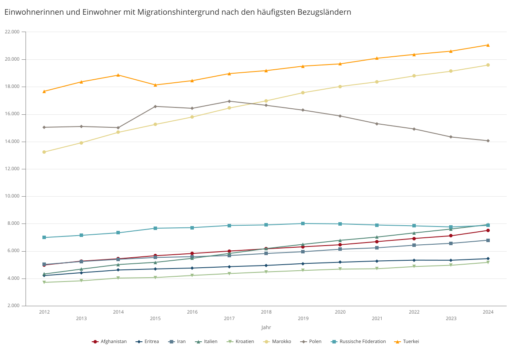

# Einführung ins Christentum
{: .r-fit-text}

### Wie entwickelte sich die Kirche außerhalb des Römischen Reiches? (III)

Sommersemester 2025
Prof. Dr. Nathan Gibson

## Ansagen

Scheine

## Lehrveranstaltungen Winter 25/26

- Interreligiöse Begegnungen und Debatten auf Arabisch vom 11. bis zum 14. Jahrhundert <https://tinygu.de/25debatten-olat>
- KI-Datenanalyse in der Religionswissenschaft (Blockseminar) <https://tinygu.de/25ki-olat>
- [Überblick über die semitischen Sprachen](https://qis.server.uni-frankfurt.de/qisserver/rds?state=verpublish&status=init&vmfile=no&moduleCall=webInfo&publishConfFile=webInfo&publishSubDir=veranstaltung&veranstaltung.veranstid=402608) (Ringvorlesung, s. QIS)
- [Grundzüge des Islam: Entstehungsgeschichte, Verbreitung, Strömungen](https://qis.server.uni-frankfurt.de/qisserver/rds?state=verpublish&status=init&vmfile=no&publishid=404582&moduleCall=webInfo&publishConfFile=webInfo&publishSubDir=veranstaltung) (Käsehage, s. QIS)
- [Wie hältst du´s mit der Kirche? Biblische sowie historische, systematische und empirische Grundlagen kirchenleitenden Handelns](https://qis.server.uni-frankfurt.de/qisserver/rds?state=verpublish&status=init&vmfile=no&publishid=411099&moduleCall=webInfo&publishConfFile=webInfo&publishSubDir=veranstaltung) (Schneider, Blockveranstaltung. s. QIS)
- [Gregor von Nyssa und seine Schrift: “Widerrede gegen Apollinaris” (Antirrheticus adversus Apolinarium)](https://qis.server.uni-frankfurt.de/qisserver/rds?state=verpublish&status=init&vmfile=no&publishid=411239&moduleCall=webInfo&publishConfFile=webInfo&publishSubDir=veranstaltung) (Kiel, Blockveranstaltung, S. QIS)

## Projekte

## Diskussion Lehrevaluation

- + Lernatmosphere
- + Lernziele, Rückblicke, (allgemeine?) Struktur
- + bunte Formate
- + Horizonterweiterung 
- - Erklärungen von einzelnen Themen, z.B.
  - gezielter
  - ausführlicher in Folien
  - mehr Zeit
- - Rote Faden
- - (noch mehr) Gruppenarbeit bzw. Exkursionen

## Einleitung

## Heutiges Lernziel

Eckpunkte der äthiopischer Selbstnarrative erzählen können. 

## Gliederung

1. Etablierung: Nubien und Äthiopien
2. Austausch mit Judentum und Islam
3. Eritrea, Äthiopien und Migration

## Etablierung: Nubien

> The gift which the king of the Romans has sent us we accept, and we will also send him a gift. But his faith we will not accept: for if we agree to become Christians, we will follow pope Theodosius who, because he was not willing to accept the evil faith of the king, he [Justinian] excommunicated and cast him [Theodosius] from his church. If, therefore, we abandon our heathenism and straying, we will not agree to fall into the evil faith. (zitiert in Bantu von Johannes von Ephesos, 6. Jhdt.)

## Etablierung: Nubien

- Oder noch früher? Im 5. Jhdt. in "Nobatia"?

> I, Silko King of the Noubades and all the Aithiopians, came to Talmis [Kalabsha] and Taphis [Tafa]. On two occasions I fought with the Blemmyes and God [theos] gave me the victory. On the third occasion I was again victorious and took control of their cities. I occupied them with my troops. On the first occasion I conquered them, and they sued for terms. I made peace with them, and they swore to me by their images [eidola] and I trusted their oath in the belief that they were honest people. I withdrew to my upper regions. (zitiert in Bantu)

## Etablierung: Nubien

- Apostelgeschichte 8: Axum (Äthiopien) oder Nubien (Kusch)?
- Moses der Schwarze? (4. Jhdt.)
- Zuflucht bei dem Kopten Shenoute von Atripe (5. Jhdt.)
- Auf jeden Fall miaphysitisch

## Etablierung: Nubien

- Welche Folgen?

## Etablierung: Äthiopien

- Kontakt mit Südarabien
- König Salomo und Königin von Saba (Legende im 14. Jhdt.)
- Ge'ez als Semitische Sprache (1. Jahrtausend v. Chr.)
- Im Neuen Testament?
  - Johannes Chrysostomus (4. Jhdt.): Äthiopien am Pfingstfest

## Etablierung: Äthiopien

- König Ezana (4. Jhdt. n. Chr.) vom Königreich Axum
- Bischof Frumentius (von Athanasius von Alexandria ordiniert)
- Die Neun Heiligen und Garima Evangelien

## Etablierung: Äthiopien

- Legenden, z.B. im 14. Jhdt.: Kebra Negast

## Austausch mit Judentum und Islam

- König Kaleb (6. Jhdt. n. Chr.)
- Jüdische Gemeinden in Äthiopien
- Muslimische Bewohner in Äthiopien (stark regional und ethnisch)

## Eritrea, Äthiopien und Migration

- 30 Jahre Krieg
- 1993 Unabhängigkeit
- Flüchtlinge u.a. nach Europa